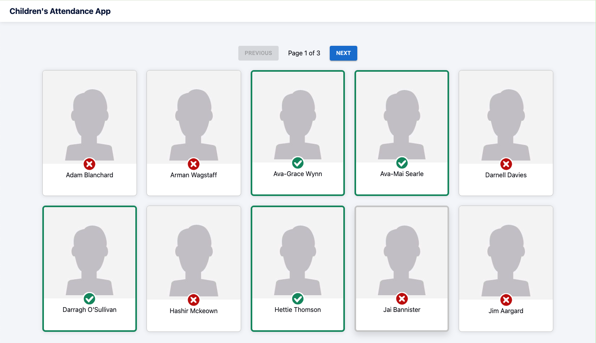

# Children's Attendance App

## 1. Requirements

[Click here](./requirements.md) and see the requirements.

## 2. Video presentation

Click [this link](https://www.loom.com/share/4d370d19f1214c05bdff51d6c203331e?sid=025e50cf-33ac-4c93-978f-474a9b98669a) to see the video presentation of the solution.

## 3. Project Overview

### Focus Areas

1. **Core Functionality**

   Implemented a responsive grid layout for displaying children's information and built reusable child card components with check-in/out functionality, focusing on making the UI intuitive and user-friendly.

2. **Type Safety**

   Used TypeScript throughout to ensure type safety and better developer experience.
   Created proper types for the Api data and components props and implemented proper error handling for API calls.

3. **Testing**

   Set up a comprehensive testing environment with Jest and React Testing Library and focused on component testing to ensure reliability. To support it, mock data to simulate real API responses was created.

### Design Decisions

1. **React Query for State Management**

   Chose React Query for data fetching and caching. The library also provides built-in loading/error states, and handles server state efficiently with automatic background updates.

2. **Component Architecture**

   Separated concerns between ChildrenGrid (layout) and ChildCard (individual display), making the code more maintainable and easier to test. Besides, it allows for future scalability and feature additions.

3. **Responsive Design**

   Used CSS Grid for layout flexibility to ensure a good user experience across different device sizes. Additionaly, it makes easier to modify layout parameters

4. **Optimistic Updates for Check-in/out**

   Implemented optimistic updates in useCheckInChild and useCheckOutChild hooks to provides instant UI feedback without waiting for API response. Improving perceived performance and user experience by reducing the need for loading states during status changes. Additionaly, set up a fall back in case the API request fails.

5. **URL Management for Pagination and Sharing**

   Update the URL's query parameters whenever the page number changes in the pagination component, without triggering a full page reload. This allows users to:

- Bookmark Pages: Users can bookmark specific pages and return to them later.
- Share URLs: Users can share links to specific pages with others.
- Browser History: The page number is preserved in the browser's history, so the back/forward buttons work as expected.
- State Persistence: If the user refreshes the page, they'll stay on the same page number instead of returning to page 1.
- SEO Friendly: Search engines can crawl different pages of your content.

### Future Improvements

1. **Performance Optimization**

- Implement virtualization to only render visible children cards, improving performance with large datasets
- Add infinite scroll
- Optimize image loading with lazy loading

2. **Enhanced Features**

- Add filtering and sorting capabilities
- Implement search functionality
- Add more detailed child information views

3. **UX Improvements**

- Implement better error handling UI

4. **Testing**

- Add end-to-end tests with Cypress
- Increase test coverage
- Add performance testing

5. **Accessibility**

- Conduct thorough accessibility audit
- Add ARIA labels where needed
- Ensure keyboard navigation works properly

## 4. Tech stack

### Frontend stack

- [React](https://reactjs.org/)
- [Tailwind](https://tailwindcss.com/)

### Build & development stack

- [TypeScript](https://www.typescriptlang.org/)
- [ESLint](https://eslint.org/)
- [Prettier](https://prettier.io/)
- [Testing Library](https://testing-library.com/docs/react-testing-library/intro/)
- [TanStack Query](https://tanstack.com/query/v5/docs/framework/react/overview)

## 5. Setup

### Requirements

1. Install [Node.js](https://nodejs.org/) v16 (or newer)
2. Install [NPM](https://www.npmjs.com/)
3. Install the project dependencies by running `npm install`.

## 6. API variables set up

To have access to the api, add your own api key to the `REACT_APP_API_ACCESS_TOKEN` variable in the `.env` file located in the root folder of the project.

## 7. Scripts

These are the main commands you'll need to execute to develop the application.

| Command          | Description                                                       |
| ---------------- | ----------------------------------------------------------------- |
| `npm start`      | Start a new local development server on [http://localhost:3000]() |
| `npm test`       | Run Jest                                                          |
| `npm run build`  | Build the site for production                                     |
| `npm run lint`   | Run Eslint                                                        |
| `npm run format` | Run Prettier                                                      |

## 8. Web Vitals

